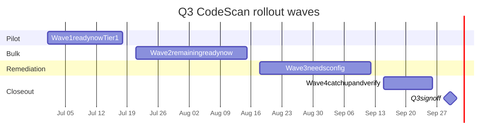

# Q3 2026 CodeScan rollout plan — `tetherto` public repos

Companion document to [codescan-public-repo-inventory.md](codescan-public-repo-inventory.md). This plan defines how weekly CodeScan (CodeQL on a schedule) will be enabled across every in-scope public repository under the `tetherto` organization during **Q3 2026 (Jul 1 – Sep 30)**.

This is a **discovery + planning** deliverable. No CodeQL workflows are enabled by this PR; that is the Q3 execution work, carved into per-wave tickets in the section "[Q3 execution carve-out](#q3-execution-carve-out)" below.

## Goal

> Q3 commitment (DevOps Q3 proposal): "Weekly CodeScan enabled for all org public repos."

Operationalized: every `ready-now` and (after blocker remediation) `needs-config` repo from the inventory has a `.github/workflows/codescan.yml` consuming the canonical reusable workflow, with at least one successful weekly run before Q3 sign-off on **2026-09-30**.

## Acceptance criteria (mirrored from ticket)

- [x] Inventory doc lists every public org repo with the captured fields (133 rows).
- [x] Rollout plan doc defines waves with target start dates within Q3 (Jul 1 – Sep 30).
- [ ] Plan is reviewed by Olu (as TL).
- [ ] Owner of weekly triage is named (see "[Weekly triage owner](#weekly-triage-owner)").
- [ ] Q3 execution tickets can be carved off the wave plan without redoing discovery.

## Scope summary (from inventory)

| Bucket | Count | In-scope for Q3 enablement |
| --- | --- | --- |
| `ready-now` | 88 | yes |
| `needs-config` | 23 | yes, after per-repo blocker fix |
| `archive-candidate` | 13 | only if owner declines to archive (else skipped) |
| `out-of-scope` | 9 | no |
| **Total** | **133** | **111 default, up to 124 if archive-candidates retained** |

Tier-1 candidates (subset of `ready-now`, see definition below): **53**.

## Tier-1 definition

A `ready-now` repo is Tier-1 if **any** of the following hold:

- Repository topic includes `qvac`, OR
- Repository name starts with `qvac-` or equals `qvac`, OR
- Repository name starts with `wdk-`, `pearpass-`, `pear-apps-`, or `svc-facs-`.

Rationale: these prefixes cover the actively-shipped product surfaces (QVAC runtime, Wallet Development Kit, PearPass, shared services and Pear-apps libraries). Tier-1 is locked at PR-review time so wave 1 is auditable; the inventory's `Tier-1` column is the source of truth.

## Wave plan (Q3 2026)



Common conventions for every wave:

- **DRI per repo** = the entry under `Primary maintainer` in the inventory; for repos showing `TBD`, the wave-DRI assigns one before that repo is enabled.
- **Wave-DRI** owns scheduling, the wave-tracking issue, and the exit-criteria sign-off.
- **Per-repo enablement PR** adds a 5–8-line `.github/workflows/codescan.yml` consuming the reusable workflow (see "[Workflow template contract](#workflow-template-contract)").
- **Exit criterion** for each repo: enablement PR merged AND first scheduled run completes successfully (not just green — a green-with-zero-results run is acceptable; a failed-extractor run is not).
- **Rollback**: disable the per-repo workflow file by deleting it. Do not revert the CodeQL database; alerts already surfaced are kept for triage history.
- **Wave success metric**: % of in-scope repos in the wave with at least one successful weekly run completed by the wave end-date.

### Wave 1 — Pilot (Tier-1 ready-now)

- Window: **Mon 2026-07-01 → Fri 2026-07-18** (3 working weeks)
- Target: **53 repos** (all `ready-now` rows where `Tier-1 = yes`)
- Wave-DRI: `TBD` — to be confirmed by Olu (TL) on PR approval
- Entry criteria:
  - Reusable workflow `.github/workflows/codescan-reusable.yml` (Giacomo's sister ticket) is merged into `tetherto/oss-actions:main` and tagged `v1`.
  - At least one DRI assigned per Tier-1 repo (filling `TBD` rows in inventory).
- Exit criteria:
  - All 53 repos have `.github/workflows/codescan.yml` merged.
  - Each repo has at least one Monday scheduled run completed successfully.
  - Open `critical`/`high` count from CodeQL summarized in the wave-1 retro issue.
- Pilot risk control: stage in two batches of ~26 repos. The first batch starts on `2026-07-01`; second batch is held until the first batch's Monday run (`2026-07-06`) is verified.

### Wave 2 — Bulk (remaining ready-now)

- Window: **Mon 2026-07-21 → Fri 2026-08-15** (4 working weeks)
- Target: **35 repos** (all `ready-now` rows where `Tier-1` is blank)
- Wave-DRI: `TBD`
- Entry criteria:
  - Wave 1 retro complete; any reusable-workflow fixes from wave 1 are merged.
  - All 35 repos have a non-`TBD` maintainer recorded.
- Exit criteria:
  - All 35 repos enabled and showing one successful weekly run.
  - Combined Wave 1 + Wave 2 coverage: 88 / 88 ready-now (= **66% of total in-scope before remediation**).

### Wave 3 — Remediation (needs-config)

- Window: **Mon 2026-08-18 → Fri 2026-09-12** (4 working weeks)
- Target: **23 repos** in `needs-config`. Track per-repo blocker resolution as separate tickets (one ticket per repo); enable as each blocker clears.
- Wave-DRI: `TBD`
- Blocker categories and resolution playbook (totals match the inventory's `Notes / blockers` column for `needs-config`; sum = 23):
  | Primary blocker | Count | Repos | Resolution |
  | --- | --- | --- | --- |
  | Native / mobile / browser-extension build pipeline | 10 | `pearpass-app-browser-extension`, `pearpass-app-desktop`, `pearpass-app-mobile`, `pearpass-lib-ui-react-native-components`, `wdk-backup-cloud-react-native`, `wdk-react-native-core`, `wdk-react-native-provider`, `wdk-react-native-secure-storage`, `wdk-starter-react-native`, `wdk-uikit-react-native` | Verify CodeQL's JS/TS extractor against the React Native or extension bundler output. Exclude bundle output dirs in `paths-ignore` (`android/**`, `ios/**`, `*.bundle.*`, extension `dist/`). |
  | Fork of upstream; verify local patches | 7 | `lib-pear-pass`, `qvac-ext-bergamot-translator`, `qvac-ext-lib-whisper.cpp`, `qvac-ext-marian-dev`, `qvac-ext-stable-diffusion.cpp`, `qvac-fabric-llm.cpp`, `wdk-safe-core-sdk` | If patches are non-trivial: scan as-is, accept upstream-noise findings will appear in alerts. If a repo is a pure mirror: move to `out-of-scope` and skip. |
  | No primary language detected; verify content | 5 | `miningos-cli`, `miningos-wrk-minerpool-luxor`, `qvac-ext-ggml`, `wdk-agent-skills`, `wdk-backup-remote` | If code lands during Q3, re-bucket as `ready-now` and enable. If still empty by `2026-09-12`, defer to Q4 and document in close-out. |
  | C/C++ requires custom build before `autobuild` | 1 | `qvac-bare-addon-example` | Add `build-mode: manual` and a per-repo build script step before `analyze`. Pin Vulkan/CUDA toolchain matching the `cpp-lint.yaml` precedent in this repo. |
- Secondary blockers: all six C++ forks (`qvac-ext-bergamot-translator`, `qvac-ext-lib-whisper.cpp`, `qvac-ext-marian-dev`, `qvac-ext-stable-diffusion.cpp`, `qvac-fabric-llm.cpp`, plus the `qvac-ext-ggml` no-language case once code is identified) **also** need the C/C++ custom-build treatment in addition to fork-patch review. Their per-repo Wave 3 ticket must apply both rows from the table above.
- Exit criteria:
  - Each `needs-config` repo either has CodeScan enabled with custom config, or has a documented decision to defer to Q4 and a follow-up ticket filed.

### Wave 4 — Catch-up and verify

- Window: **Mon 2026-09-15 → Fri 2026-09-26** (2 working weeks)
- Targets:
  - Any repo from Waves 1–3 whose first scheduled run failed and has not been remediated.
  - `archive-candidate` decisions: 13 repos. Each owner either confirms "archive" (then we mark archived in GitHub before sign-off) or rejects (then the repo enters Wave 4 enablement).
- Wave-DRI: `TBD`
- Exit criteria:
  - 0 in-scope repos with status "enabled but never had a successful weekly run".
  - Archive decisions recorded for all 13 archive-candidates.

### Q3 sign-off — 2026-09-30

Close-out report attached as a comment on the rollout-plan PR (or as a follow-up doc in this folder), containing:

- Final coverage: `enabled / in-scope = X / Y`.
- Carry-over to Q4: list of repos and reason.
- Triage backlog snapshot: open `critical` / `high` / `medium` counts per Tier-1 repo.

## Workflow template contract

The reusable CodeQL workflow itself is delivered by the sister Giacomo ticket and is expected to live at `.github/workflows/codescan-reusable.yml` in this repo. The rollout plan does not redefine the YAML; it specifies the contract every consumer repo must satisfy.

### Reusable workflow contract

| Field | Required value or default |
| --- | --- |
| Trigger | `schedule: cron: '17 4 * * 1'` (Monday 04:17 UTC) plus `workflow_dispatch` |
| Permissions (caller) | `actions: read`, `contents: read`, `security-events: write` |
| Pinned actions | `github/codeql-action/init@v3`, `github/codeql-action/analyze@v3` (SHA-pinned at template-time, version-bumped quarterly) |
| Default `languages` | auto-detect via `init` if input not given |
| Default `queries` | `security-extended` |
| Default `paths-ignore` | `vendor/**`, `dist/**`, `build/**`, `**/*.min.js`, `**/__generated__/**` |
| Output | SARIF uploaded to GitHub code scanning; alerts visible under repo Security tab |

### Per-repo consumer file (canonical shape)

A consumer repo adds the following file. This is illustrative — the reusable workflow's actual input names are confirmed by Giacomo's sister ticket before Wave 1.

```yaml
name: CodeScan
on:
  schedule:
    - cron: '17 4 * * 1'
  workflow_dispatch:
permissions:
  actions: read
  contents: read
  security-events: write
jobs:
  codescan:
    uses: tetherto/oss-actions/.github/workflows/codescan-reusable.yml@v1
    with:
      languages: javascript
```

`needs-config` repos override `paths-ignore`, `build-mode`, or `languages` as appropriate per the [Wave 3 blocker table](#wave-3--remediation-needs-config).

## Escalation path for critical findings on a public repo

1. **Detection.** A CodeQL alert at severity `critical` or `high` on a default-branch run is treated as in-scope for escalation. Lower severities follow normal triage cadence.
2. **Auto-issue.** A small follow-up workflow (out of scope for this PR; tracked as a Wave-1 dependency) opens an issue with label `security/critical` in the affected repo, linking the alert URL and the triage owner.
3. **Acknowledgement.** Triage owner (see next section) acknowledges within **one business day** by commenting on the issue.
4. **Triage decision tree:**
   - **Exploitable in production** → open a private Security Advisory in the affected repo, create a private fork to develop the fix, coordinate disclosure window with the product DRI, then merge the public PR. Reference the GHSA ID in the public commit message.
   - **Theoretically exploitable, no prod impact** → patch in a normal PR within 7 calendar days; reference the alert ID in the PR description.
   - **False positive** → dismiss the alert in the GitHub UI with rationale recorded in the dismissal note. Triage owner approval is required for dismissals on Tier-1 repos.
5. **Weekly summary.** Triage owner posts a weekly comment on a tracking issue in this repo with the count of open `critical` / `high` per repo. This comment is the inventory's authoritative status until the next snapshot.

## Weekly triage owner

- **Designated owner:** `TBD` — to be confirmed by Olu (TL) on PR approval.
- **Backstop rotation:** if no single owner is named, rotate weekly across the security-interested maintainers listed in the affected repo's `CODEOWNERS`. Wave-DRIs fill the rotation calendar at the end of Wave 1.
- **Cadence:** triage runs every Monday on the prior week's scans. SLA: ack within 1 business day, decision within 5 business days for `high`, within 2 business days for `critical`.
- **Escalation if owner unavailable:** Olu (TL) is fallback; `@tetherto/qvac-internal-merge` is final fallback for Tier-1 repos in the QVAC product surface.

## Q3 execution carve-out

Tickets that can be opened verbatim from this plan once approved, so discovery does not have to be redone:

1. **CodeScan Wave 1 — pilot (Tier-1 ready-now, 53 repos)** — start `2026-07-01`, end `2026-07-18`. Depends on reusable-workflow ticket. Subtasks: assign DRI per repo, raise enablement PRs in two batches.
2. **CodeScan Wave 2 — bulk (remaining ready-now, 35 repos)** — start `2026-07-21`, end `2026-08-15`. Depends on Wave 1 retro.
3. **CodeScan Wave 3 — needs-config remediation (23 repos)** — start `2026-08-18`, end `2026-09-12`. Spawns one sub-ticket per repo, prefilled with the matching blocker row from [Wave 3 blocker table](#wave-3--remediation-needs-config).
4. **CodeScan Wave 4 — catch-up + archive decisions (up to 13 repos)** — start `2026-09-15`, end `2026-09-26`.
5. **CodeScan auto-issue workflow** — Wave-1 dependency. Adds the small workflow that creates `security/critical` issues on `critical`/`high` alerts.
6. **Q3 sign-off close-out** — due `2026-09-30`. Output: close-out comment on the rollout PR or follow-up doc in `docs/security/`.

Each ticket links back to this document and to the inventory row(s) it concerns.

## What this plan deliberately does not do

- Does not enable CodeScan on any repository (this is Wave 1 onward).
- Does not author the reusable CodeQL workflow YAML (delivered by Giacomo's sister ticket).
- Does not cover private repos (separate scope).
- Does not commit a regenerator script for the inventory (snapshot-only, per scope agreement). The next snapshot will be a fresh PR replacing the inventory file.
