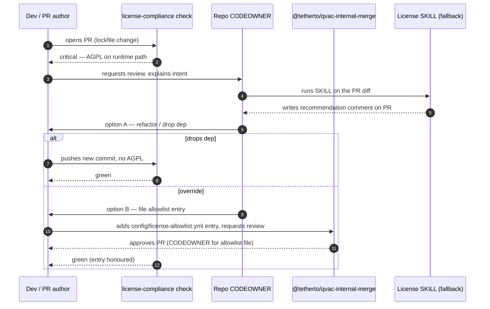

# Q3 2026 license / compliance CI gate — design doc

Companion document to [codescan-q3-rollout-plan.md](codescan-q3-rollout-plan.md) and [codescan-public-repo-inventory.md](codescan-public-repo-inventory.md). This doc decides how the existing license / NOTICE / compliance **SKILL** (today: an agent-driven checklist that humans run on a PR) becomes an actual **CI gate** on Tier-1 `tetherto` public repos during **Q3 2026**.

This is a **design / planning** deliverable. No CI gate is enabled by this PR; the implementation is the Q3 ticket carved out at the bottom of this doc. The Q2 outcome is this document plus Olu's sign-off.

## Goal

> Q2 commitment (DevOps Q2 proposal): "Move license/compliance SKILL into CI — design doc (fail vs warn, exceptions)."
> Q3 commitment (DevOps Q3 proposal): "License / compliance enforced in CI on Tier-1 (SKILL becomes fallback)."

Operationalized: by the end of Q3, every Tier-1 `ready-now` repo (53 repos per the [inventory](codescan-public-repo-inventory.md#summary)) has a required status check `license-compliance` that runs on every PR to a default branch, fails on critical / high findings per the [Fail vs warn matrix](#fail-vs-warn-matrix), and surfaces a documented exception path. The SKILL stops being primary enforcement and becomes the named fallback for cases the gate can't decide automatically.

## Acceptance criteria (mirrored from ticket)

- [x] Markdown design doc committed under `docs/security/`.
- [x] Fail-vs-warn matrix explicit, with examples (see [Fail vs warn matrix](#fail-vs-warn-matrix)).
- [x] Exception flow documented end-to-end (see [Exception flow](#exception-flow)).
- [x] Pilot Tier-1 repo named (see [Rollout sequencing](#rollout-sequencing)).
- [x] SKILL fallback contract documented (see [Fallback to the SKILL](#fallback-to-the-skill)).
- [ ] Olu (TL) signs off; this doc becomes the spec for the Q3 implementation ticket.

## Why a CI gate, why now

The SKILL today is a written checklist run by a human (or an agent on the human's behalf) before merge. It works, but it has two structural problems for a Q3 enforcement target:

1. **It is advisory.** A reviewer can forget to run it, and nothing in CI prevents a merge. There is no auditable record on the PR that the check was performed.
2. **It does not see lockfile drift.** A new transitive dependency added by `npm install` arrives without anyone noticing the licence chain. The SKILL only catches what the reviewer manually inspects.

Moving the deterministic part of the SKILL (licence allow/deny, NOTICE presence, lockfile-drift detection) into CI fixes both. The judgement-heavy part (novel licences, negotiated exceptions, dual-licensed code with conditions) stays human, but is now **explicitly named as the fallback path** rather than the default.

## What the gate checks

The gate is a single required status check named `license-compliance`. It performs three checks, in this order, against the merge-base diff of the PR:

### Check 1 — Disallowed licences on the runtime path

For every dependency that is reachable from the production / runtime entry points of the package (see [Runtime-path definition](#runtime-path-definition) below), the gate resolves the SPDX identifier and compares it against two lists:

- **Allowed:** `Apache-2.0`, `MIT`, `BSD-2-Clause`, `BSD-3-Clause`, `ISC`, `MPL-2.0` (file-level copyleft, acceptable for linked use), `CC0-1.0`, `Unlicense`.
- **Disallowed:** `AGPL-1.0`, `AGPL-3.0`, `AGPL-3.0-only`, `AGPL-3.0-or-later`, `SSPL-1.0`, `Commons-Clause`, `BUSL-1.1`, `EUPL-1.2`, `GPL-2.0`, `GPL-3.0` (network-copyleft and source-availability licences that are incompatible with the closed product surfaces shipping in QVAC / WDK / PearPass).

Anything not in either list is **unknown** and falls through to Check 2's "high" tier.

The lists live in this repo at `config/license-policy.yml` (path proposed; file does not yet exist — created by the implementation ticket, not this PR). They are the single source of truth across all consumer repos. Drift between repos is forbidden by design.

### Check 2 — Required attribution (NOTICE)

For every dependency that ships in a built artefact (npm package tarball, Pear bundle, mobile app bundle, container image, model weights), the gate requires:

- The dependency's licence text is reproduced under `third-party/<package>/LICENSE` **or** the repo's `NOTICE` file contains an entry naming the dependency, its version, and its SPDX id.
- For models specifically: the model card (or a `MODEL_NOTICE.md`) lists the upstream model, training-data licence (if known), and any redistribution conditions.

This check is necessary even for fully-allowed licences (`Apache-2.0`, `MPL-2.0`, `BSD-*` all require attribution in distribution).

NOTICE auto-generation is **explicitly out of scope** for this design (separate Q3 ticket). The gate only checks presence, not generation.

### Check 3 — Lockfile drift

For every PR that modifies `package-lock.json`, `pnpm-lock.yaml`, `yarn.lock`, `Cargo.lock`, `requirements.txt`, `poetry.lock`, `Pipfile.lock`, or any other supported lockfile, the gate:

1. Computes the set of newly-introduced packages (present in PR-head, absent in merge-base).
2. For each new package, resolves its SPDX licence from the registry metadata.
3. Re-runs Check 1 on those new packages, scoped to whichever of `dependencies` / `devDependencies` / `optionalDependencies` they landed in.

This is the check the SKILL most often misses today: a transitive arrives with `peerDependencies` indirection and nobody re-runs the licence audit.

### Runtime-path definition

The gate has to know which dependencies are runtime-shipped vs build-time-only, because Check 1's strictness depends on it. Per ecosystem:

| Ecosystem | Runtime path = | Build-time-only = |
| --- | --- | --- |
| npm / pnpm / yarn (Node, Bare, browser) | `dependencies`, `optionalDependencies`, anything walked from a runtime entry point | `devDependencies`, anything reached only from `scripts.test` / `scripts.build` |
| Python (pip / poetry) | `[project.dependencies]` / poetry `tool.poetry.dependencies` | `[project.optional-dependencies.dev]` / poetry `tool.poetry.group.dev.dependencies` |
| Rust (cargo) | `[dependencies]`, `[target.*.dependencies]` | `[dev-dependencies]`, `[build-dependencies]` |
| C/C++ via vcpkg / CMake | runtime libraries linked into the shipped binary | header-only test deps, gtest, formatters |
| Models / weights | every binary blob shipped in a release artefact | training scripts, evaluation harnesses |

Build-time-only dependencies still go through Check 1, but a disallowed licence on a build-time-only dep is **high (override-able)**, not **critical (hard fail)**. See [Fail vs warn matrix](#fail-vs-warn-matrix).

## Fail vs warn matrix

This is the source of truth. The status check `license-compliance` reports one of four severities; only the first two block the PR.

| Severity | Behaviour | What triggers it | Override path |
| --- | --- | --- | --- |
| **critical** | hard fail; status check red; merge blocked even with admin override unless the exception is recorded per [Exception flow](#exception-flow) | disallowed licence (e.g. `AGPL-3.0`, `SSPL-1.0`, `BUSL-1.1`) on a runtime-path dependency, **OR** a runtime-path dependency newly added with no resolvable licence at all | maintainer files an entry in `config/license-allowlist.yml` AND a CODEOWNER from `@tetherto/qvac-internal-merge` (Tier-1 fallback owner from the CodeScan plan) approves the PR |
| **high** | fail; status check red; merge blocked but unblockable by the exception flow without escalation | unknown / unreviewed licence on any dependency, disallowed licence on a build-time-only dependency, NOTICE missing for a shipped third-party package or model | maintainer files an entry in `config/license-allowlist.yml`; one repo CODEOWNER approves; SKILL run recorded on the PR |
| **medium** | warn; status check green with annotations; informational PR comment | licence changed upstream in a minor version bump (e.g. `MIT` → `Apache-2.0`), NOTICE entry exists but version-pin is stale, dual-licensed package picked the wrong leg | none required; reviewer judgement |
| **info** | annotation only; no PR comment | new dependency added with already-allowed licence and complete NOTICE entry; recorded for telemetry only | n/a |

### Worked examples

1. **A Tier-1 wallet repo (`wdk-wallet-evm`) bumps `ethers` to a major that newly bundles a transitive under `AGPL-3.0`.**
   - Check 1 flags the new transitive on the runtime path (`dependencies`).
   - SPDX is in the disallowed list.
   - Severity: **critical**. PR blocked.
   - Resolution: either replace the transitive, pin to the prior major, or — if maintainer judges this acceptable for some isolated reason — escalate to `@tetherto/qvac-internal-merge`, file the allowlist entry, and run the SKILL to record the rationale.

2. **`pearpass-lib-vault` adds a new dev dependency under `GPL-2.0` (e.g. a code-formatting tool).**
   - Check 3 detects the new lockfile entry.
   - It resolves to `devDependencies`, so it is build-time-only.
   - SPDX is in the disallowed list, but the runtime-path rule is not triggered.
   - Severity: **high**. PR blocked, but a single repo CODEOWNER approval plus an allowlist entry unblocks it.

3. **`qvac` bumps a model weight file. The accompanying licence file is present but the SPDX id is unrecognized (`NOASSERTION`).**
   - Check 1 cannot classify; falls through to "unknown".
   - Severity: **high**. PR blocked.
   - Resolution: maintainer reads the licence, decides allow / deny, files allowlist entry with the SPDX id they have agreed to treat the licence as, and (per [Fallback to the SKILL](#fallback-to-the-skill)) attaches the SKILL run output to the PR.

4. **`svc-facs-mqtt` updates `aedes` from `0.50` → `0.51`. Same `MIT` licence both sides, no new transitives.**
   - Check 3 finds the lockfile change, but no new packages.
   - Severity: **info**. PR not annotated except for telemetry counter.

5. **A documentation-only PR on a Tier-1 repo (no lockfile change).**
   - All three checks are no-ops.
   - Severity: **info**. Status check green immediately. The gate must be cheap enough that this is the common case.

### Why this split, not a single fail / no-fail toggle

A binary fail / no-fail makes the gate too easy to disable. Tier-1 repos are heavily reviewed; if every unknown licence hard-fails, maintainers will start either pinning forever or adding admin overrides, neither of which is auditable. The four-tier split keeps **critical** strictly mechanical (the allowlist file is the only legal way past it) and lets **high** absorb the messy real-world cases without the maintainer needing two approvals for routine patch bumps.

## Exception flow

Every override leaves an auditable trail. There is exactly one mechanism: an entry in `config/license-allowlist.yml` in the **consumer repo** (not in `oss-actions`), reviewed via the standard PR process and CODEOWNERS-protected.

### Allowlist file shape

```yaml
version: 1
entries:
  - package: example-bsl-package
    ecosystem: npm
    version_range: ">=2.0.0 <3.0.0"
    spdx: BUSL-1.1
    runtime_path: false
    rationale: |
      Build-time only; used by the docs site generator.
      Upstream relicensed in 2.0; we do not redistribute the build output.
    approved_by: "@tetherto/qvac-internal-merge"
    approved_at: 2026-08-12
    expires_at: 2027-02-12
    pr: https://github.com/tetherto/<repo>/pull/<n>
    skill_run: <link to SKILL run output, if applicable>
```

Field rules:

- `version_range` is required and must be bounded above. `*` is rejected by the gate to prevent open-ended exceptions.
- `runtime_path` must match what the gate detects. Lying here is caught by Check 1 on the next run.
- `rationale` must be non-empty and human-readable. The gate does not parse it, but a reviewer is expected to read it.
- `approved_by` must be a GitHub team or user that is in the repo's `CODEOWNERS` for `config/license-allowlist.yml`.
- `expires_at` is required and capped at **6 months from `approved_at`**. The gate fails the entry as `high` once expired, forcing re-review. This prevents stale allowlists from becoming invisible.
- `skill_run` is required for **critical** overrides and entries with `spdx: NOASSERTION`. Optional for **high** overrides on already-known SPDX ids.

### Where the allowlist lives, who can edit

- **File location:** `config/license-allowlist.yml` in the consumer repo. **Not** in `oss-actions`. Each Tier-1 repo owns its own exceptions; org-wide allowlisting is rejected as a design choice (see [Why per-repo, not org-wide](#why-per-repo-not-org-wide) below).
- **CODEOWNERS for the allowlist file:** every Tier-1 repo's `CODEOWNERS` must add a line `config/license-allowlist.yml @tetherto/qvac-internal-merge` (the Tier-1 fallback owner already used by the CodeScan escalation path). For non-QVAC Tier-1 repos (`wdk-*`, `pearpass-*`, `pear-apps-*`, `svc-facs-*`), the owning team takes the `@tetherto/qvac-internal-merge` slot.
- **Repos without `CODEOWNERS` today:** per the inventory, 95 of 133 repos do not yet have a `CODEOWNERS` file. The gate's enable-PR (the per-repo Q3 enablement task) will add `CODEOWNERS` if missing; this is the same pattern Wave 1 of the CodeScan rollout uses to fill `TBD` maintainers.

### End-to-end flow on a PR that hits a critical finding



Auditability:

- The allowlist entry is committed code, so its history is in `git log`.
- The PR that added the entry is linked from the entry itself (`pr: ...`) and from the `Approved` review on GitHub.
- The SKILL run output is linked from `skill_run:` for critical overrides.
- For Tier-1 repos, all three (commit, PR review, SKILL run) are present for every critical override. This satisfies the "auditable trail" acceptance criterion.

### Why per-repo, not org-wide

A single `oss-actions/config/license-allowlist.yml` would be tempting (one source of truth, no drift), but it has two problems for our shape:

1. **Blast radius.** An entry that is fine for a build-time tool in `wdk-docs` is not automatically fine for `wdk-wallet-evm`. Per-repo entries force the maintainer to make the call in context.
2. **Review surface.** `oss-actions` already has `@tetherto/qvac-internal-merge` review traffic for workflow changes. Funnelling every Tier-1 licence exception through this repo would create a review queue this team cannot reasonably staff.

Per-repo allowlists, with the **policy file** (`config/license-policy.yml` — allowed list, disallowed list, severity rules) centralised in `oss-actions`, gives us the right split: org-wide policy is one file with one review path; exceptions are local and small.

## Fallback to the SKILL

When this design is delivered, the SKILL stops being the primary gate but does not go away. It is the named fallback for the cases the CI gate cannot decide.

### When the gate hands off to the SKILL

The gate explicitly surfaces a "run the SKILL" annotation on the PR in any of these cases:

1. **Novel licence.** SPDX id is not in the allowed list, not in the disallowed list, not in the consumer's allowlist. Severity is **high**; the PR comment posted by the gate links to the SKILL invocation and asks the maintainer to record the SKILL output before approving an allowlist entry.
2. **`NOASSERTION` from the registry.** Licence file is present upstream but does not match an SPDX id GitHub recognizes. Twenty-three Tier-1 candidates already fall in this state per the [inventory](codescan-public-repo-inventory.md#inventory) (`pearpass-*`, `pear-apps-*`, `wdk-react-native-secure-storage`, `tether-dev-docs`, `wdk-worklet-bundler`). The gate cannot mechanically allow these; the SKILL is required to read the actual text, decide an SPDX equivalent, and the maintainer files an allowlist entry pinning that interpretation.
3. **Dual-licensed packages with conditions.** Some licences (`MPL-2.0` with extra exhibits, `Apache-2.0 WITH LLVM-exception`, `BSD-3-Clause-Clear`) need a human to read the conditions. The gate flags these as **high** and points to the SKILL.
4. **Models and weights.** The SKILL has heuristics for model cards (training-data licence, redistribution conditions, "research-only" clauses) that are difficult to encode in a deterministic check. For any model file added to a release artefact, the gate emits a **high** finding with `reason: model-attribution-review-required` and the SKILL is the named follow-up.
5. **Gate failure / timeout.** If the gate workflow itself fails to run (registry outage, lockfile parser crash), the consumer repo's required check fails-closed. The SKILL is the documented manual fallback for the merge to proceed: maintainer runs the SKILL on the PR diff, posts the output as a PR comment, and an admin override on the failed required check is permitted **only** when accompanied by that SKILL comment.

### What the SKILL does in fallback mode that CI cannot

- Reads natural-language licence text and maps it to an intended SPDX id.
- Inspects model cards, training-data provenance, redistribution constraints.
- Reviews "courtesy" attribution requests (e.g. "please retain this notice in About boxes") that are not strictly mechanical.
- Cross-checks against existing NOTICE entries to spot drift.
- Produces a structured comment on the PR that the maintainer pastes (or links) into the allowlist entry's `rationale:` and `skill_run:` fields.

### What the SKILL does NOT do in fallback mode

- It does not run automatically. It is human-invoked (or agent-invoked on behalf of the human).
- It does not edit `config/license-allowlist.yml`. Allowlist edits remain a deliberate, code-reviewed change.
- It is not a substitute for CODEOWNER approval on critical overrides.

This split — **deterministic checks in CI, judgement calls in SKILL, both recorded on the PR** — is the central design idea of the gate.

## Rollout sequencing

Following the same wave shape as the [CodeScan rollout plan](codescan-q3-rollout-plan.md#wave-plan-q3-2026), but the licence-gate rollout is narrower (Tier-1 only this Q3) and starts with a single repo to control friction.

### Pilot repo: `wdk-utils`

First Tier-1 repo to enable the gate is **[`wdk-utils`](https://github.com/tetherto/wdk-utils)**.

Why this repo, judged against the inventory:

- **Tier-1.** `wdk-` prefix puts it in scope by definition.
- **Apache-2.0 itself.** Picking a repo whose own licence is already a clean allowed SPDX id removes one source of confusion — the gate's findings will be about *dependencies*, not about the host repo.
- **Pure JavaScript, `ready-now` bucket.** No native build, no React Native bundler, no fork-of-upstream concerns. The gate's lockfile-parsing logic only has to handle `package-lock.json`.
- **Small dependency surface.** It is a utility library; the lockfile is short enough that a manual sweep of the first run's findings is feasible. Friction will be measurable, not overwhelming.
- **Active.** Last push 2026-05-18 per the inventory; PRs land regularly, so the gate gets exercised within a week of enablement.
- **Not on the critical path.** Compared with `qvac` or `wdk-wallet-evm`, a temporarily-broken licence gate on `wdk-utils` does not block product releases. This is the dial we want for a pilot.

### Expected friction

Honest list, so it is recorded for the pilot retro:

1. **First-run noise on transitive `NOASSERTION` deps.** Even MIT-only top-levels may have one or two transitives whose `package.json` doesn't declare `license`. These will show as **high**. The pilot will batch-approve a single allowlist PR after the SKILL is run on each.
2. **NOTICE may not exist.** `wdk-utils` ships under Apache-2.0 and likely needs a NOTICE file added for the existing third-party deps. The pilot includes that as a one-time prep PR before the gate is required, so the gate's first real run is on a known-clean state.
3. **CODEOWNERS not yet present.** Per the inventory, `wdk-utils` shows `TBD` for primary maintainer. The enablement PR will add `CODEOWNERS` covering at least `config/license-allowlist.yml` (per-this-design requirement) at the same time as the workflow file. This is a precondition, not a blocker discovered in flight.
4. **Lockfile-drift false positives on patch bumps.** A `dependabot`-style patch bump that touches the lockfile without changing licences should be **info**, not **high**. The gate's diff logic must compare *resolved licences* not *resolved versions* to avoid this. If the first week of pilot data shows >5% false-positive rate from this category, the gate's diff logic is the first thing to tune.
5. **Maintainer surprise.** Some maintainers will hit the gate before reading this doc. The enablement PR posts a one-paragraph PR-template snippet linking back here, so the explanation is one click away.

### Telemetry to capture before expanding

The expansion gate from "pilot succeeded" to "expand to remaining Tier-1" is data-driven. The implementation ticket adds a small results-collection step that posts to a tracking issue in this repo (mirroring the CodeScan plan's weekly-triage pattern). Per pilot run, capture:

| Metric | Definition | Target before expanding |
| --- | --- | --- |
| **False-positive rate** | (findings dismissed as wrong) / (total findings) over the pilot window | < 10 % on **high**; < 2 % on **critical** |
| **Time-to-resolve, high** | median time from finding to either fix-merged or allowlist-entry-merged | < 2 business days |
| **Time-to-resolve, critical** | same, for critical findings | < 5 business days; **0 cases** of critical override without SKILL run linked |
| **PR friction** | additional median PR open-to-merge time on PRs the gate touched, vs. the prior 30-day baseline on the same repo | < +1 business day |
| **Allowlist churn** | count of entries added per week | flat or decreasing after week 2 (a rising count means the allowed list itself is wrong) |
| **SKILL-fallback rate** | (PRs where SKILL was invoked) / (PRs where the gate produced any finding) | tracked, not gated; informs whether the allowed list needs updates |

The pilot runs for **at least three full PR-cycles** on `wdk-utils` (target: 2 working weeks of normal traffic, minimum) before any second repo is enabled. If any target above is missed, the implementation ticket is paused, the cause is documented in the pilot retro, and the policy / gate is adjusted before expanding.

### After the pilot

If pilot targets are met, the expansion order across the remaining 52 Tier-1 repos follows the same risk-staging shape as CodeScan Wave 1:

1. **Expansion batch A — utility libraries** (`wdk-pricing-bitfinex-http`, `wdk-pricing-provider`, `wdk-secret-manager`, `wdk-failover-provider`, `wdk-mcp-toolkit`, `pear-apps-utils-*`, `pearpass-utils-*`). Same shape as `wdk-utils`: pure JS, small lockfile, low blast radius.
2. **Expansion batch B — service-facing libraries** (`svc-facs-*`).
3. **Expansion batch C — wallet and protocol libraries** (`wdk-wallet*`, `wdk-protocol-*`).
4. **Expansion batch D — flagship product surfaces** (`qvac`, `wdk`, `pearpass-lib-vault*`, `pearpass-lib-data-*`).

Org-wide rollout beyond Tier-1 is **out of scope for this Q3 ticket**.

## Implementation outline (for scoping the Q3 ticket — not the implementation itself)

This section is **deliberately not the implementation**. It exists so the Q3 implementation ticket can be sized without redoing this design.

### Components the implementation will need

1. **Reusable workflow** at `.github/workflows/license-compliance-reusable.yml` in this repo, callable from any consumer with `uses: tetherto/oss-actions/.github/workflows/license-compliance-reusable.yml@v1`.
2. **Policy file** at `config/license-policy.yml` in this repo. Holds the allowed list, disallowed list, and the severity rules from the [Fail vs warn matrix](#fail-vs-warn-matrix).
3. **Per-repo consumer file** in each Tier-1 repo at `.github/workflows/license-compliance.yml`. 5–8 lines, mirrors the CodeScan consumer-file pattern.
4. **Per-repo allowlist** at `config/license-allowlist.yml` in each consumer (created by the enablement PR; can be empty initially).
5. **Per-repo `CODEOWNERS` line** for `config/license-allowlist.yml`, added by the enablement PR if missing.
6. **Required-status-check setting** on the default branch of each Tier-1 repo, set to `license-compliance` (the job name from the reusable workflow).
7. **Telemetry hook** posting per-PR finding counts to a tracking issue in `oss-actions` for the duration of pilot. Removed or downgraded after expansion.

### Tooling choices to make at implementation time

This design does not pick the underlying scanner, deliberately. The implementation ticket should evaluate at least:

- **`license-checker` / `license-checker-rseidelsohn`** for npm trees.
- **GitHub's own `dependency-review-action`** — already integrates with the dependency graph, has a built-in licence-check input, and avoids re-implementing transitive resolution. Strong default candidate; the implementation ticket should justify if it picks anything else.
- **`pip-licenses` / `pipdeptree`** for Python repos in scope (`qvac-rnd-fabric-llm-bitnet`, `qvac-rnd-fabric-llm-finetune`).
- **`cargo-deny`** if any Tier-1 Rust repos appear in future waves (none in current Tier-1).

The reusable workflow must be tool-agnostic at the contract level: input is "ecosystem + lockfile path", output is "list of (package, version, spdx, runtime_path, severity)". The scanner is swappable.

### Per-repo enablement PR (canonical shape)

```yaml
name: License compliance
on:
  pull_request:
    branches: [main]
permissions:
  contents: read
  pull-requests: write
jobs:
  license-compliance:
    uses: tetherto/oss-actions/.github/workflows/license-compliance-reusable.yml@v1
    with:
      ecosystems: npm
      allowlist_path: config/license-allowlist.yml
```

`needs-config` repos (none in pilot) will override `ecosystems` and may add a `paths-ignore` input.

### Out of scope for the implementation ticket

- NOTICE auto-generation (separate Q3 ticket per acceptance criteria).
- Org-wide rollout beyond Tier-1.
- Backfilling allowlist entries for historical findings on existing default-branch state.
- Private repos.

## What this design deliberately does not do

- Does not enable the gate on any repository (this is the Q3 implementation ticket).
- Does not author the reusable workflow YAML (delivered by the implementation ticket).
- Does not auto-generate NOTICE files.
- Does not roll out to non-Tier-1 repos in Q3.
- Does not change the SKILL itself; the SKILL keeps working in its current form, just gets a new role.

## Q3 execution carve-out

Tickets that can be opened verbatim from this design once approved:

1. **Implement license-compliance reusable workflow** — owner: Giacomo. Adds `.github/workflows/license-compliance-reusable.yml` and `config/license-policy.yml` to this repo. Depends on this design doc being approved.
2. **Pilot license-compliance gate on `wdk-utils`** — start once (1) is tagged `v1`. Includes prep PR (NOTICE + CODEOWNERS), enablement PR, then required-status-check toggle. Captures 2 weeks of telemetry.
3. **Expand to Tier-1 batch A — utility libraries** — depends on (2) hitting the targets in [Telemetry to capture before expanding](#telemetry-to-capture-before-expanding). Pattern: one enablement PR per repo, batched into a single tracking issue.
4. **Expand to Tier-1 batches B / C / D** — sequenced through Q3 close-out.
5. **NOTICE auto-generation** — explicitly separate Q3 ticket; this design assumes manual maintenance for now.

Each ticket links back to this document and to the row(s) it concerns in the [inventory](codescan-public-repo-inventory.md#inventory).

